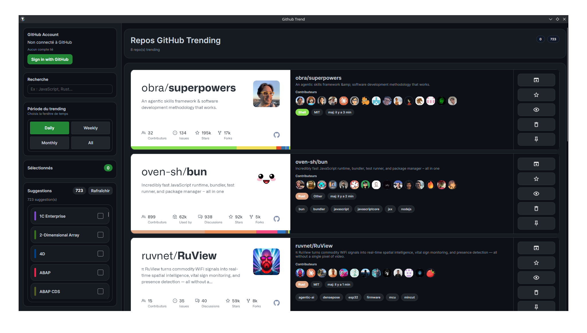
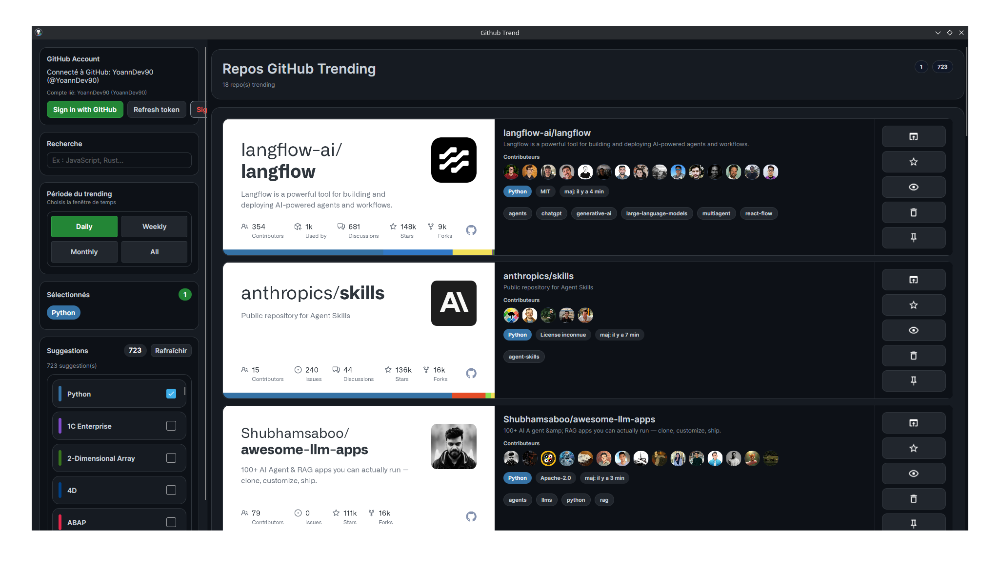

# Github Trend

`Github Trend` is a desktop app built with [Avalonia UI](https://avaloniaui.net/) that presents GitHub trending repositories in a richer card-based interface, with repository details, visuals, filters, and GitHub actions.

## What the app does

The app focuses on one job: make GitHub Trending easier to browse and act on.

It lets you:

- browse GitHub trending repositories by time range:
  - daily
  - weekly
  - monthly
  - all time
- filter the list by programming language
- search the available language filters quickly
- open any repository in your default browser
- display repository banners, topics, contributors, stars, forks, license, language, and last updated date
- star repositories directly from the app
- watch repositories directly from the app
- sign in through GitHub OAuth device flow without managing a personal access token manually

## Authentication model

Authentication is now intentionally simple:

- the app uses GitHub OAuth device flow to obtain a **user access token**
- star/watch actions use that user token, not an installation token
- the token is stored locally on the machine and protected before being written to disk
- there are no runtime environment variables to configure

If GitHub returns an authorization error for a repository action, the usual fix is to sign out and sign in again so the app gets a fresh user token with the current scopes.

## Configuration

All app-level GitHub configuration is centralized in `Constants.cs`.

This file is the single place to review or change:

- GitHub App client id
- GitHub App client secret placeholder
- personal access token placeholder
- callback and local base URLs used by the legacy OAuth helpers
- GitHub API URL and headers
- trending data source URL
- language colors source URL

There is no `.env`-style setup in the current app flow.

## Features in detail

### Trending feed

The main view combines several data sources to enrich each repository card:

- trending repository list
- repository metadata from the GitHub API
- language color information
- contributor previews
- repository banner images

### Repository actions

Each card exposes common actions:

- open the repository page
- star the repository
- watch the repository

When GitHub requires a more specific authorization scope, the app now surfaces a clearer message so you know whether you simply need to re-authenticate.

### Visual layout

The interface is designed to be information-dense without becoming hard to scan:

- dark themed cards
- prominent repository title and description
- topic badges
- avatar previews for contributors
- fast language filtering

## Screenshots




## Requirements

- .NET 10 SDK
- a desktop environment supported by Avalonia

## Run

From the project root:

```bash
dotnet restore
dotnet run
```

## Build

```bash
dotnet build
```

## Project structure

- `App.axaml` / `App.axaml.cs` - app bootstrap and global styling
- `MainWindow.axaml` / `MainWindow.axaml.cs` - main UI and window behavior
- `ViewModels/` - MVVM view models and commands
- `Models/` - trending repository and GitHub data models
- `Services/` - GitHub API, trending fetch, auth, colors, and persistence services
- `Controls/` - custom controls used by the UI
- `Constants.cs` - centralized application configuration

## Data sources

- Trending repositories:
  - `https://githubtrending.lessx.xyz/trending`
- Language colors:
  - `https://raw.githubusercontent.com/ozh/github-colors/master/colors.json`
- Repository details, contributors, topics, licenses, star, and watch actions:
  - GitHub REST API

## Notes

- Repository banners are loaded from GitHub OpenGraph images.
- Contributor avatars are fetched on demand.
- The app stores its local token data in the user profile and protects it before saving.
- The GitHub watch action requires the `notifications` scope, so if you changed auth settings you should reconnect once.

## Current status

The app currently supports:

- trending browsing
- language filtering
- repository details enrichment
- OAuth device-flow sign-in
- direct starring
- direct watching

