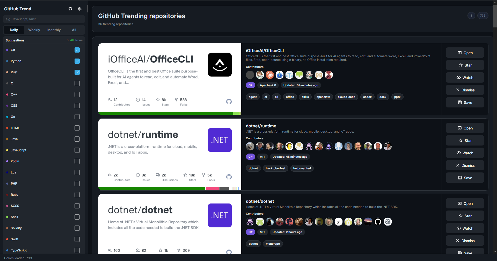
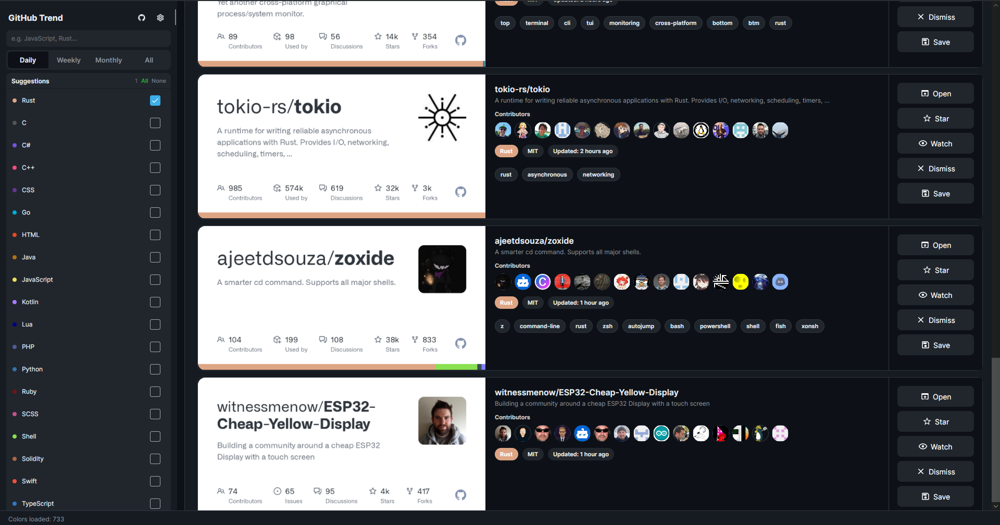

# GitHub Trend

Desktop app to browse GitHub trending repos. Card-based UI, no browser needed.

## Features

- Browse trending repos (daily, weekly, monthly, all time)
- Filter by language, search languages fast
- Star/watch repos directly from the app (with GitHub login)
- See description, topics, contributors, stars, forks, license, language, last update
- Click to open repo in browser
- Login through GitHub OAuth device flow, no manual token management

## Download

Pre-built packages on the [releases page](https://github.com/YoannDev90/Github-Trend/releases).

| OS      | Architectures  | Status                              |
|---------|----------------|-------------------------------------|
| Windows | x64, arm64     | Supported (installer)               |
| Linux   | x64, arm64     | Supported (binary, DEB, RPM, AppImage) |
| macOS   | x64, arm64     | Needs a tester/contributor          |

### Windows

Download the `.exe` installer and run it.

### Linux

```bash
tar -xzf Github-Trend-linux-x64.tar.gz
cd Github-Trend-linux-x64
./Github-Trend
```

## Login

Uses GitHub's OAuth device flow. No tokens to generate or manage. Stored locally.

Token expired or got auth errors? Sign out and sign back in.

## Interface

- Dark theme cards
- Language colors for quick scan
- Contributor avatars
- Language filter with search

## Screenshots




## Requirements

- Windows, macOS, or Linux
- Internet connection

## FAQ

**Q: Is my token safe?**  
A: Stored locally, encrypted on disk.

**Q: Do I need .NET installed?**  
A: No, pre-built packages bundle everything. Only needed to build from source.

**Q: Why do I get auth errors?**  
A: Some actions need specific permissions. Sign out and back in to refresh.
